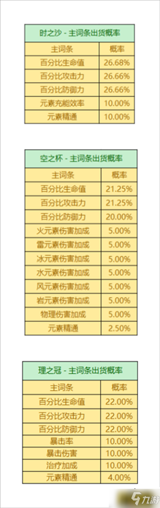

# Introduction

该项目用Monte-Carlo模拟分析了在原神游戏中，获得主词条正确的圣遗物所需要的天数

# Usage

### Step 1:

用python IDE打开 combinations.py 文件，里面总共有两个可修改变量：

**(1) test_comb**

**(2) ddl**

**test_comb**是一个列表，列表中的每一个元素都是一个三维列表，三个维度分别代表时之沙、空之杯和理之冠的主词条：

(a) 第一维标号0 - 4，分别代表生命值，攻击力，防御力，元素充能效率和元素精通；

(b) 第二维标号0 - 10，分别代表生命值，攻击力，防御力，火、雷、冰、水、风、岩伤害加成和物理伤害加成以及元素精通；

(c) 第三维标号0 - 6，分别代表生命值，攻击力，防御力，暴击率，暴击伤害，治疗加成和元素精通的概率

例如，需要一个攻爆套，5号位理之冠一定得是暴击/暴伤，另外两个位置只能是攻击(因为不可能是双暴)，这个时候可以将脚本改成：

```python
my_comb = [
	[1, 1, 3],
	[1, 1, 4]
]
test_comb = my_comb
```

**ddl** = n表示在n天前圣遗物毕业的概率，如果设置为 -1，则不考虑该参数


在 main.py 中可以修改num_epoch，其表示进行Monte-Carlo模拟迭代的次数

### Step 2:

在对应文件夹下运行：

```
python main.py
```

或者配置IDE并运行

# Some Results

总共进行10,000次Monte-Carlo模拟：

(1) 三个都带生命

期望刷本次数：35.907
期望刷本天数:  3.990
在4天内出货的概率是：0.608

(2) 三个都带攻击/防御

期望刷本次数：36.410
期望刷本天数:  4.046
在4天内出货的概率是：0.599

(3) 3号和4号位带攻击，5号位带双暴

期望刷本次数：45.426
期望刷本天数:  5.047
在5天内出货的概率是：0.600

(4) 全带精通

期望刷本次数：183.131
期望刷本天数:  20.348
在20天内出货的概率是：0.610

(5) 3号和4号位带精通，5号位带双爆

期望刷本次数：121.541
期望刷本天数:  13.505
在14天内出货的概率是：0.624

(6) 3号位带充能，4号位带精通，5号位带双暴

期望刷本次数：121.126
期望刷本天数:  13.458
在14天内出货的概率是：0.628

# References

[原神圣遗物掉落概率是多少 圣遗物掉落概率机制一览](http://news.17173.com/z/ys/content/04112022/175316199.shtml)

